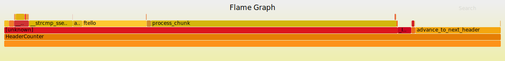
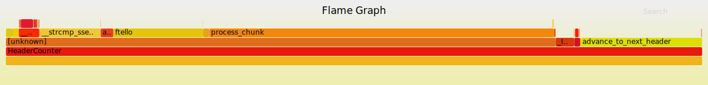

# Header Counter lib
# Two data structure backends.
Both methods take advantage of the known key-space at compile time.
Both solutions provide consistent, efficient memory utilization and are
cache friendly. They aren't thread-safe, but could easily be if an
atomic increment was used.

#API - header_counter_header_code.h
- #### bool HdrCtr_valid_header(HeaderCounter const *, char const * header)
returns true if header is a valid header.

- #### bool HdrCtr_increment(HeaderCounter *, char const * header);
if header is found, increment it by 1.

- #### HeaderCounter * HdrCtr_new(void);
allocates space for a HeaderCounter struct and array of {header, count} pairs.

- #### void HdrCtr_free(HeaderCounter *);
simply frees the allocated space. (free wrapper)

- #### void HdrCtr_merge_counters(HeaderCounter * dest, HeaderCounter const * src);
for each header, add the matching header count from src to dest.

- #### void HdrCtr_print(FILE *, HeaderCounter const *);
print the {header, count} pairs separated by a space to the specified stream. One per line.

# Architecture
Each new HeaderCounter needs a copy of the compile-time headers array.
This array stores the {header, count} pairs.

These pairs are stored in a HeaderCounter. They contains a flexible array
member (you often see string objects use this "trick").
```
typedef struct {
   int size;
   Header headers[]
} HeaderCounter;
```
To init a new HeaderCounter, space must be allocated for the struct members (int size)
and the space for a copy of the compile time array. The compile time array can
then be memcopy'ed at the array allocated at the end of the struct.

# Python scripts are used.
* mk\_header.py: parses a key list from a file, outputs to a file generating
a list of struct initializations to be used in as the hash table.

* perfect_hash.py: generates a perfect minimal hash from the key list file.
It generates two arrays, the minimal data array, and an intermediate array
used to index into the minimal array. The script also parses a template file
to generate the minimal hash code (\*.tmpl.\* files).

# hash_counter
hash_counter utilizes a perfect minimal hash generator: http://ilan.schnell-web.net/prog/perfect-hash/
Note: I don't see an explicit license.

There are a handful of others, but I found this one convenient.

A perfect hash ensures no table collisions. A minimal perfect hash ensures no
collisions and 100% table utilization (dense!).

The hash table is filled with {header, count} pairs (HeaderCounter).

### Complexity
n = predefined header keys,
m = max header length

* table {looks ups, updates} are O(1) (in terms of n) as there are no collisions.
* Though, in terms of m, the complexity is O(7m) -> O(m).
* The implementation is also very cache friendly; the data used is dense, and small.
* Memory complexity is \Theta (n), where n is constant.
* Possible optimizations: A cheaper hash function could be explored.

### Flame Graph


# binary_search_counter
binary\_search\_counter utilizes compile-time sorted keys to enable fast searching.
The search array is filled with struct {header, count} pairs (HeaderCounter).
** This solution has little testing.**

Though, the little testing that has been done show the performance to be nearly indistinguishable from the hash_counter. 

### Complexity
n = predefined header keys,
m = max header length

* table {look ups, updates} are O(log(n)) -> O(1), as n is constant.
* In terms of m, the complexity is O(log(n) * m), which compares favorably to
the perfect hash solution when n is _small_ (which it is for the task given).
* This technique is also very cache friendly, the array is dense, and small.
* The lower complexity to this solution is also appealing.

### Flame Graph


# Additional solutions
### Trie
a trie was not implemented, but could provide a viable alternative (but with added complexity).

### Linear Key Search
even a linear search through the key-space will likely provide adequate performance here. There aren't a lot of headers.
Performance data would need to be gathered, and considered with design complexity to
decide what solution fits best.
